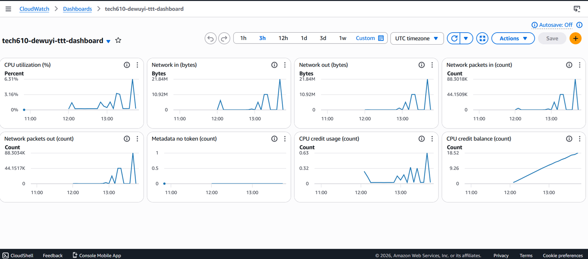

## Performance Testing

Performance testing is a non-functional software testing technique that measures the stability, speed and responsiveness of an application or server under load

Performance testing includes 
Load Testing, where we simulate the expected traffic/load to a system with during regular operations with the key purpose being to make sure that the system is ready and stable for everyday use.

Stress Testing, where we push the system beyond its normal limits to find out where it breaks, for the purpose of preparing a system for surges in traffic.

## Code along and Alarm testing

A dashboard was first set up to allow us better insight into how our instance was performing and if it was under heavy load or not, we did this by going to the monitoring tab within our instance and first turning on Detailed monitoring within Managed detailed monitoring, to get updates each minute rather than every 5. and secondly clicked on the 3 dots below that button to add all these metric to our new dashboard

### Apache load testing
After SSHing into our instance we first installed Apache:
```bash
sudo apt update -y
sudo apt install apache2-utils
```
we then used this command to send requests to our server
```bash
ab -n 1000 -c 100 http://<VM_IPv4>/
```
`-n` refers to the number of requests being sent
`-c` refers to the amount of requests being sent at once(concurrency)
for the purpose of performance testing we progressively increased the quantity of requests and the concurrency of them, seeing the load it put on the CPU as seen by the CPU utilisation spikes getting progressively higher for the request number it ranged from 1000-20000 and for the concurrency it was 100-300


While load testing we implemented an alarm alert to trigger when the CPU utilisation reached a certain threshold, for testing purposes, it was set to trigger at 10% utilisation, in a real system you'd expect an alarm to trigger at a higher threshold, and possibly for the surges to occur more than once before any action is taken. In a server in use these alarms are useful for auto scaling when a server or system gets an unexpected surge in traffic

